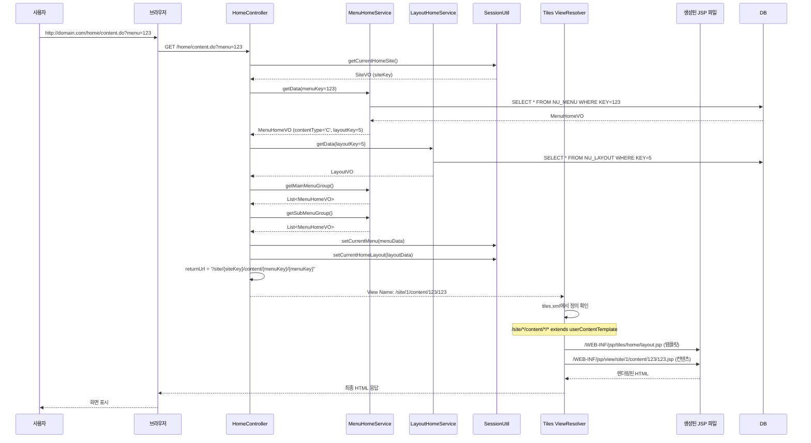

# 홈페이지 렌더링 엔진 분석 (Reverse Engineering)

## 개요

townE 시스템은 **DB 저장형 CMS**로, HTML/JS/CSS 소스 코드를 데이터베이스에 저장하고, 런타임에 이를 파일로 생성하여 동적으로 화면을 렌더링하는 구조입니다.

## 핵심 아키텍처

### 1. DB 저장형 소스 코드 구조

#### 테이블: `NU_CONTENTS`
```sql
CREATE TABLE NU_CONTENTS (
    MENUKEY INT PRIMARY KEY,
    HTML TEXT,           -- HTML 소스 코드
    JS TEXT,             -- JavaScript 소스 코드  
    CSS TEXT,            -- CSS 스타일 코드
    INSERTDATE DATETIME,
    UPDATEDATE DATETIME,
    INSERTIP VARCHAR(50),
    INSERTMEMBERKEY INT,
    UPDATEIP VARCHAR(50),
    UPDATEMEMBERKEY INT
);
```

#### 테이블: `NU_MENU`
```sql
CREATE TABLE NU_MENU (
    `KEY` INT PRIMARY KEY,
    SITEKEY INT,
    TITLE VARCHAR(255),
    CONTENTTYPE VARCHAR(1),  -- 'C': Content, 'B': Board, 'L': Link, 'M': Menu, 'P': Program
    LAYOUTKEY INT,
    ACCESSROLE VARCHAR(1),
    STATUS VARCHAR(1),        -- 'U': Use, 'D': Delete
    MENUCODE VARCHAR(50),
    STEPALL VARCHAR(100),
    PARENTKEY INT,
    DEPTH INT,
    ...
);
```

### 2. 소스 코드 파일 생성 프로세스

#### 2.1 관리자에서 컨텐츠 저장 시

```java
// ContentServiceImpl.java
@Override
public void insert(ContentVO cvo){
    // 1. DB에 저장
    cMapper.insert(cvo);
    
    // 2. Context Path 치환
    String html = ContextPathUtil.replaceContextPath(cvo.getHtml());
    String css = ContextPathUtil.replaceContextPath(cvo.getCss());
    String js = ContextPathUtil.replaceContextPath(cvo.getJs());
    
    cvo.setHtml(html);
    cvo.setCss(css);
    cvo.setJs(js);
    
    // 3. 파일로 생성
    ContentFileUtil.makeFile(cvo);
}
```

#### 2.2 파일 생성 로직

```java
// ContentFileUtil.java
public static void makeFile(ContentVO content) {
    int siteKey = SessionUtil.getCurrentSite().getKey();
    
    // 저장 경로: /WEB-INF/jsp/view/site/{siteKey}/content/{menuKey}/
    String savePath = File.separator + "WEB-INF" + File.separator + "jsp" 
                    + File.separator + "view" + File.separator + "site" 
                    + File.separator + String.valueOf(siteKey) 
                    + File.separator + "content" 
                    + File.separator + String.valueOf(content.getMenuKey()) 
                    + File.separator;
    
    String uploadPath = CommonUtil.getRealPath() + savePath;
    
    // JSP 파일 생성 (HTML + JSP 헤더)
    String jspFileName = uploadPath + String.valueOf(content.getMenuKey()) + ".jsp";
    osw = new OutputStreamWriter(new FileOutputStream(jspFileName), Charset.forName("UTF-8").newEncoder());
    osw.write(JSP_HEADER);  // JSP 디렉티브 추가
    osw.write(content.getHtml());
    osw.close();
    
    // JS 파일 생성
    String jsFileName = uploadPath + String.valueOf(content.getMenuKey()) + ".js";
    osw = new OutputStreamWriter(new FileOutputStream(jsFileName), Charset.forName("UTF-8").newEncoder());
    osw.write(content.getJs());
    osw.close();
    
    // CSS 파일 생성
    String cssFileName = uploadPath + String.valueOf(content.getMenuKey()) + ".css";
    osw = new OutputStreamWriter(new FileOutputStream(cssFileName), Charset.forName("UTF-8").newEncoder());
    osw.write(CSS_HEADER);  // @charset "utf-8"; 추가
    osw.write(content.getCss());
    osw.close();
}
```

**생성되는 파일 구조:**
```
WEB-INF/jsp/view/site/{siteKey}/content/{menuKey}/
  ├── {menuKey}.jsp    (HTML 소스)
  ├── {menuKey}.js     (JavaScript 소스)
  └── {menuKey}.css    (CSS 소스)
```

### 3. 사용자 접속 시 렌더링 프로세스

#### 3.1 요청 흐름 시퀀스



#### 3.2 Controller 로직 상세

```java
// HomeController.java
@RequestMapping(value="/home/content.do", method=RequestMethod.GET)
public String contentMenuCodeV(Model model, @RequestParam("menu") String menu, 
                               HttpServletRequest req, HttpServletResponse res, Device device) {
    // 1. 현재 사이트 정보 조회
    int siteKey = SessionUtil.getCurrentHomeSite().getKey();
    
    // 2. 메뉴 정보 조회
    MenuHomeVO menuSearch = new MenuHomeVO();
    menuSearch.setSiteKey(siteKey);
    menuSearch.setKey(Integer.valueOf(menu));
    MenuHomeVO menuData = menuService.getData(menuSearch);
    
    // 3. 권한 체크
    MemberHomeVO memberData = SessionUtil.getCurrentHomeMember();
    int memberLevel = 0;
    if(memberData.getKey() != null && memberData.getKey() > 0) {
        memberLevel = Integer.parseInt(memberData.getMemberLevel());
    }
    
    if(memberLevel < Integer.valueOf(menuData.getAccessRole())) {
        return "redirect:/home/member/loginV.do";
    }
    
    // 4. 메뉴 리스트 조회 (네비게이션용)
    List<MenuHomeVO> mainMenuList = menuService.getMainMenuGroup(menuData);
    List<MenuHomeVO> subMenuList = menuService.getSubMenuGroup(menuData);
    
    // 5. 레이아웃 정보 조회
    LayoutVO layoutData = layoutService.getData(menuData.getLayoutKey());
    
    // 6. 세션에 저장
    SessionUtil.setCurrentMenu(menuData);
    SessionUtil.setCurrentMainMenu(mainMenuList);
    SessionUtil.setCurrentSubMenu(subMenuList);
    SessionUtil.setCurrentHomeLayout(layoutData);
    
    // 7. 컨텐츠 타입에 따른 URL 반환
    if(menuData.getContentType().equals("C")) {  // Content 타입
        returnUrl = "/site/"+siteKey+"/content/"+menuData.getKey()+"/"+menuData.getKey();
    } else if(menuData.getContentType().equals("B")) {  // Board 타입
        returnUrl = "redirect:/home/board/list.do?boardKey="+menuData.getBoardKey();
    } else if(menuData.getContentType().equals("L")) {  // Link 타입
        returnUrl = "redirect:" + menuData.getUrl();
    } else if(menuData.getContentType().equals("P")) {  // Program 타입
        returnUrl = "redirect:/home/programs/" + menuData.getUrl() + "?menu=" + menuData.getKey();
    }
    
    return returnUrl;
}
```

### 4. Tiles 템플릿 시스템

#### 4.1 Tiles 설정 파일

```xml
<!-- tiles.xml -->
<definition name="userContentTemplate" template="/WEB-INF/jsp/tiles/home/layout.jsp">
    <put-attribute name="header" value="/WEB-INF/jsp/tiles/home/header.jsp" />
    <put-attribute name="left" value="/WEB-INF/jsp/tiles/home/left.jsp" />
    <put-attribute name="content"/>
    <put-attribute name="footer" value="/WEB-INF/jsp/tiles/home/footer.jsp" />
</definition>

<definition name="/site/*/content/*/*" extends="userContentTemplate">
    <put-attribute name="content" value="/WEB-INF/jsp/view/site/{1}/content/{2}/{3}.jsp" />
</definition>
```

**URL 패턴 매칭:**
- `/site/1/content/123/123` → `{1}=1, {2}=123, {3}=123`
- 최종 컨텐츠 경로: `/WEB-INF/jsp/view/site/1/content/123/123.jsp`

#### 4.2 레이아웃 템플릿 구조

```jsp
<!-- /WEB-INF/jsp/tiles/home/layout.jsp -->
<!DOCTYPE html>
<html lang="${currentHomeSite.lang}">
<head>
    ${currentLayout.meta}
    <title>${currentHomeSite.title}</title>
    
    <!-- 레이아웃 JS/CSS -->
    <script src="${_url}/download/layout/js/${currentLayout.key}.do"></script>
    <link rel="stylesheet" href="${_url}/download/layout/css/${currentLayout.key}.do" />
    
    <!-- 컨텐츠 JS/CSS -->
    <script src="${_url}/download/content/js/${currentMenu.key}.do"></script>
    <link rel="stylesheet" href="${_url}/download/content/css/${currentMenu.key}.do" />
</head>
<body>
    <!--Header-->
    <tiles:insertAttribute name="header"/>
    <!--Left-->
    <tiles:insertAttribute name="left"/>
    <!--Content-->
    <tiles:insertAttribute name="content"/>  <!-- 여기에 DB에서 생성된 JSP 삽입 -->
    <!--Footer-->
    <tiles:insertAttribute name="footer"/>
</body>
</html>
```

### 5. 동적 리소스 다운로드

#### 5.1 컨텐츠 JS/CSS 다운로드 Controller

```java
// ContentDownloadController.java (추정)
@RequestMapping("/download/content/js/{menuKey}.do")
public void downloadContentJs(@PathVariable int menuKey, HttpServletResponse response) {
    // /WEB-INF/jsp/view/site/{siteKey}/content/{menuKey}/{menuKey}.js 파일 읽기
    // response에 출력
}

@RequestMapping("/download/content/css/{menuKey}.do")
public void downloadContentCss(@PathVariable int menuKey, HttpServletResponse response) {
    // /WEB-INF/jsp/view/site/{siteKey}/content/{menuKey}/{menuKey}.css 파일 읽기
    // response에 출력
}
```

### 6. 핵심 특징 및 제약사항

#### 6.1 DB 저장형 소스의 장점
- ✅ 관리자가 웹 UI에서 직접 HTML/JS/CSS 편집 가능
- ✅ 컨텐츠 변경 시 재배포 불필요
- ✅ 버전 관리 가능 (NU_CONTENTS_HISTORY 테이블)

#### 6.2 DB 저장형 소스의 단점
- ❌ **런타임 파일 생성**: 관리자가 저장할 때마다 파일 시스템에 쓰기 작업 발생
- ❌ **성능 이슈**: 파일 I/O 오버헤드
- ❌ **동시성 문제**: 여러 관리자가 동시에 수정 시 파일 충돌 가능성
- ❌ **디버깅 어려움**: 소스 코드가 DB와 파일 시스템에 분산
- ❌ **버전 관리 어려움**: Git 등 표준 버전 관리 시스템과 연동 불가

#### 6.3 마이그레이션 시 고려사항
1. **파일 생성 로직 제거**: DB에서 직접 읽어서 렌더링하거나, CDN/Static Storage 활용
2. **템플릿 엔진 변경**: JSP → React/Vue.js 컴포넌트로 변환
3. **동적 리소스 처리**: Webpack 등 빌드 도구로 정적 자산화
4. **캐싱 전략**: Redis 등으로 컨텐츠 캐싱

## 결론

townE의 렌더링 엔진은 **"DB 저장 → 파일 생성 → Tiles 템플릿 조합"** 방식으로 동작합니다. 이는 전형적인 레거시 CMS 패턴이며, 현대적인 SPA 아키텍처로 마이그레이션 시 전체 렌더링 파이프라인을 재설계해야 합니다.

