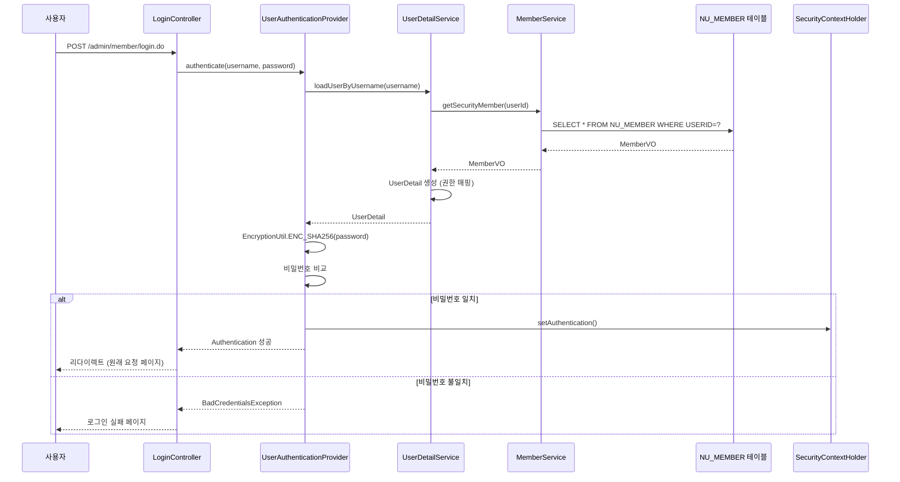
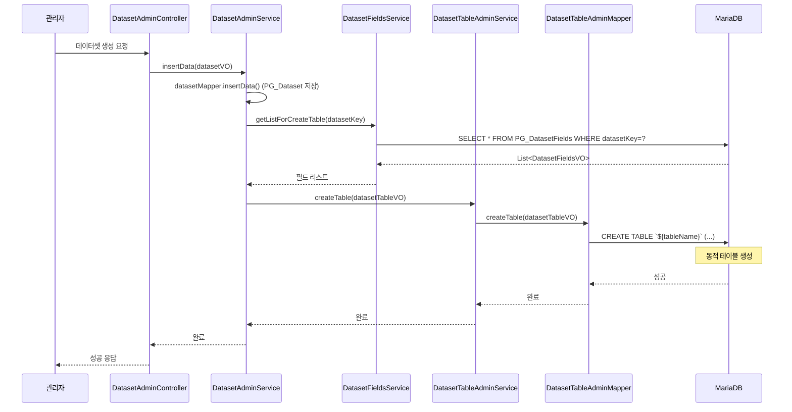

# 서비스 비즈니스 로직 심층 분석

## 1. 인증 및 권한 관리 시스템

### 1.1 인증 아키텍처

townE는 **Spring Security 3.2**를 기반으로 한 커스텀 인증 시스템을 사용합니다.

#### 인증 흐름



### 1.2 비밀번호 암호화

```java
// UserAuthenticationProvider.java
public Authentication authenticate(Authentication authentication) {
    UsernamePasswordAuthenticationToken auth = (UsernamePasswordAuthenticationToken) authentication;
    String password = auth.getCredentials().toString();
    
    UserDetail userDetails = (UserDetail) this.userDetailsService.loadUserByUsername(auth.getName());
    
    // SHA-256 암호화 (Salt 없음)
    String encPassword = EncryptionUtil.ENC_SHA256(password);
    
    if (!userDetails.getPassword().equals(encPassword)) {
        throw new BadCredentialsException("ID나 비밀번호가 잘못되었습니다.");
    }
    
    return new UsernamePasswordAuthenticationToken(userDetails, auth.getCredentials(), userDetails.getAuthorities());
}
```

**보안 취약점:**
- ❌ **Salt 미사용**: SHA-256 단방향 해시만 사용, 레인보우 테이블 공격에 취약
- ❌ **단순 비교**: 평문 비밀번호를 SHA-256으로 변환 후 DB 저장값과 직접 비교
- ⚠️ **권장사항**: BCrypt, Argon2 등 적응형 해시 함수 사용 필요

### 1.3 권한 계층 구조

```java
// UserDetail.java
public UserDetail(MemberVO _member, RoleHierarchy roleHierarchy) {
    this.mvo = _member;
    
    // NU_MEMBER.MEMBERLEVEL에 따른 권한 매핑
    switch(_member.getMemberLevel()) {
        case "1": case "2":
            authorities.add(new SimpleGrantedAuthority("ROLE_GUEST"));
            break;
        case "3": case "4": case "5": case "6": case "7":
            authorities.add(new SimpleGrantedAuthority("ROLE_USER"));
            break;
        case "8": case "9":
            authorities.add(new SimpleGrantedAuthority("ROLE_ADMIN"));
            break;
    }
}
```

**권한 계층 (context-security.xml):**
```xml
<bean id="roleHierarchy" class="org.springframework.security.access.hierarchicalroles.RoleHierarchyImpl">
    <property name="hierarchy">
        <value>
            ROLE_ADMIN > ROLE_USER
            ROLE_USER > ROLE_GUEST
            ROLE_GUEST > ROLE_ANONYMOUS
        </value>
    </property>
</bean>
```

**권한 체크 로직:**
```java
// HomeController.java
MemberHomeVO memberData = SessionUtil.getCurrentHomeMember();
int memberLevel = Integer.parseInt(memberData.getMemberLevel());

// 메뉴 접근 권한 체크
if(memberLevel < Integer.valueOf(menuData.getAccessRole())) {
    return "redirect:/home/member/loginV.do";
}

// 게시판 접근 권한 체크
if(Integer.parseInt(menuData.getAccessRole()) > memberLevel) {
    returnUrl = "redirect:/common/roleError.jsp";
}
```

### 1.4 SNS 로그인 지원

```java
// UserDetailService.java
@Override
public UserDetails loadUserByUsername(String userId) {
    String loginType = (String) attr.getRequest().getSession().getAttribute("login_type");
    String snsType = (String) attr.getRequest().getSession().getAttribute("login_snsType");
    String snsCertKey = (String) attr.getRequest().getSession().getAttribute("login_snsCertKey");
    
    MemberVO mvo = new MemberVO();
    if("sns".equals(loginType)) {
        // SNS 로그인: CERTKEY1, CERTKEY2로 조회
        mvo = memberService.getDataBySns(snsType, snsCertKey);
    } else {
        // 일반 로그인: USERID로 조회
        mvo.setUserId(userId);
        mvo = memberService.getSecurityMember(mvo);
    }
    
    return new UserDetail(mvo, roleHierarchy);
}
```

**SNS 로그인 테이블 구조:**
- `NU_MEMBER.CERTTYPE`: 인증 타입 (예: 'KAKAO', 'NAVER', 'GOOGLE')
- `NU_MEMBER.CERTKEY1`: SNS 고유 ID
- `NU_MEMBER.CERTKEY2`: 추가 인증 정보

### 1.5 권한 체크 허점 분석

#### 문제점 1: 세션 기반 권한 체크
```java
// SessionUtil.getCurrentHomeMember()는 세션에서 조회
// 세션 하이재킹 시 권한 우회 가능
MemberHomeVO memberData = SessionUtil.getCurrentHomeMember();
int memberLevel = Integer.parseInt(memberData.getMemberLevel());
```

#### 문제점 2: DB 저장형 권한 체크
```java
// NU_MENU.ACCESSROLE은 DB에 저장된 값
// 런타임에 DB 변경 시 즉시 반영되어 보안 정책 우회 가능
if(memberLevel < Integer.valueOf(menuData.getAccessRole())) {
    return "redirect:/home/member/loginV.do";
}
```

#### 문제점 3: 하드코딩된 권한 레벨
- 권한 레벨이 코드에 하드코딩되어 있어 유연성 부족
- 새로운 권한 레벨 추가 시 코드 수정 필요

## 2. 데이터셋 모듈의 동적 테이블 생성

### 2.1 동적 테이블 생성 프로세스

데이터셋 모듈은 관리자가 필드를 정의하면, 런타임에 실제 DB 테이블을 생성하는 구조입니다.

#### 생성 흐름



### 2.2 동적 테이블 생성 SQL

```xml
<!-- datasetTableAdminMapper_SQL.xml -->
<insert id="createTable" parameterType="datasetTableAdminVO">
    CREATE TABLE `${tableName}` (
        `key` INT NOT NULL AUTO_INCREMENT
        , `datasetFileKey` INT NOT NULL
        , `regDate` TIMESTAMP NOT NULL DEFAULT CURRENT_TIMESTAMP
        , `status` CHAR(1) NOT NULL
        <if test="fieldsList!=null and fieldsList.size() > 0">
            <foreach collection="fieldsList" item="item" index="index" separator="," open=",">
            `${item.field}` ${item.type}
                <if test='item.type.equals("VARCHAR")'>(${item.length})</if> 
                <if test='item.required.equals("Y")'>NOT</if> NULL
            </foreach>
        </if>
        , PRIMARY KEY (`KEY`)
    )
</insert>
```

**예시 생성 테이블:**
```sql
CREATE TABLE `PG_DatasetTable_123` (
    `key` INT NOT NULL AUTO_INCREMENT,
    `datasetFileKey` INT NOT NULL,
    `regDate` TIMESTAMP NOT NULL DEFAULT CURRENT_TIMESTAMP,
    `status` CHAR(1) NOT NULL,
    `name` VARCHAR(100) NOT NULL,
    `age` INT NULL,
    `address` VARCHAR(255) NULL,
    PRIMARY KEY (`KEY`)
);
```

### 2.3 동적 테이블 조회

```java
// DatasetTableAdminServiceImpl.java
@Override
public List<HashMap<String, Object>> getListByPage(SearchDatasetTableAdminVO search) {
    // 테이블명이 동적이므로 MyBatis에서 직접 테이블명 지정
    return datasetTableMapper.getListByPage(search);
}
```

```xml
<!-- datasetTableAdminMapper_SQL.xml -->
<select id="getListByPage" parameterType="searchDatasetTableAdminVO" resultType="hashmap">
    SELECT * FROM `${tableName}`
    WHERE `status` = 'U'
    <if test="searchKeyword != null and searchKeyword != ''">
        AND `${searchType}` LIKE CONCAT('%', #{searchKeyword}, '%')
    </if>
    ORDER BY `key` DESC
    LIMIT #{firstRecordIndex}, #{recordCountPerPage}
</select>
```

### 2.4 동적 테이블 수정 (컬럼 추가/수정/삭제)

```xml
<!-- 컬럼 추가 -->
<update id="addColumn" parameterType="datasetTableAdminVO">
    ALTER TABLE `${tableName}`
        <foreach collection="fieldsList" item="item" index="index" separator=",">
            ADD COLUMN `${item.field}` 
                ${item.type}<if test='item.type.equals("VARCHAR")'>(${item.length})</if> 
                <if test='item.required.equals("Y")'>NOT</if> NULL
        </foreach>
</update>

<!-- 컬럼 수정 -->
<update id="editColumn" parameterType="datasetTableAdminVO">
    ALTER TABLE `${tableName}`
        <foreach collection="fieldsList" item="item" index="index" separator=",">
            CHANGE COLUMN `${item.beforeField}` `${item.field}`
                ${item.type}<if test='item.type.equals("VARCHAR")'>(${item.length})</if> 
                <if test='item.required.equals("Y")'>NOT</if> NULL
        </foreach>
</update>

<!-- 컬럼 삭제 -->
<update id="dropColumn" parameterType="datasetTableAdminVO">
    ALTER TABLE `${tableName}`
        <foreach collection="fieldsList" item="item" index="index" separator=",">
            DROP COLUMN `${item.field}`
        </foreach>
</update>
```

### 2.5 동적 테이블의 문제점

#### 문제점 1: SQL Injection 위험
```xml
<!-- 테이블명과 컬럼명이 사용자 입력값으로 직접 사용됨 -->
SELECT * FROM `${tableName}` WHERE `${searchType}` LIKE ...
```
- 테이블명/컬럼명 검증 로직 필요
- 화이트리스트 기반 검증 필수

#### 문제점 2: 스키마 관리 어려움
- 동적 테이블은 ORM 매핑 불가
- 마이그레이션 도구(예: Flyway, Liquibase)와 호환 어려움
- 테이블 구조 변경 이력 추적 어려움

#### 문제점 3: 성능 이슈
- 동적 테이블 생성 시 DB 락 발생 가능
- 인덱스 최적화 어려움
- 쿼리 플랜 캐싱 불가

## 3. 게시판 검색 및 조회 로직

### 3.1 검색 조건 처리

```java
// BoardController.java
@RequestMapping(value="/list.do")
public String listV(Model model, @ModelAttribute("search") SearchBoardItemVO search, 
                    HttpServletRequest req, Device device) {
    // 검색 조건 세션 저장
    SessionUtil.setSearchQuery(CommonUtil.getUrlParameter(req));
    
    // 게시글 목록 조회
    int count = boardItemService.getAllCount(search);
    int countNormal = boardItemService.getCountNormal(search);
    
    if(boardData.getBoardType().equals("FAQ")) {
        model.addAttribute("list", boardItemService.getList(search));
    } else {
        model.addAttribute("listNotice", boardItemService.getPageNoticeList(search));
        model.addAttribute("listNormal", boardItemService.getPageNormalList(search));
    }
}
```

### 3.2 검색 쿼리 구조

```xml
<!-- boardItemMapper_SQL.xml -->
<sql id="condition">
    <if test="categoryKey > 0">
        AND CATEGORYKEY = #{categoryKey}
    </if>
    <if test="writer != null and writer != ''">
        AND WRITER LIKE CONCAT('%',#{writer},'%')
    </if>
    <if test="title != null and title != ''">
        AND TITLE LIKE CONCAT('%',#{title},'%')
    </if>
    <if test="content != null and content != ''">
        AND CONTENT LIKE CONCAT('%',#{content},'%')
    </if>
    <if test="searchType == 'ALL' and searchKeyword != null and searchKeyword != ''">
        AND ( (TITLE LIKE CONCAT('%', #{searchKeyword}, '%')) 
           OR (CONTENT LIKE CONCAT('%', #{searchKeyword}, '%')) )
    </if>
    <if test="searchType != 'ALL' and searchKeyword!=null and searchKeyword!=''">
        AND `${searchType}` LIKE CONCAT('%',#{searchKeyword},'%')
    </if>
</sql>
```

**검색 타입:**
- `ALL`: 제목 + 내용 통합 검색
- `TITLE`: 제목만 검색
- `CONTENT`: 내용만 검색
- `WRITER`: 작성자 검색

### 3.3 공지사항/일반 게시글 분리

```xml
<!-- 공지사항 목록 -->
<select id="getPageNoticeList" resultType="boardItemHomeVO">
    SELECT I.*, ...
    FROM NU_BOARD_ITEM I
    WHERE ...
        AND NOTICE = 'Y'
    ORDER BY I.NOTICE ASC, I.INSERTDATE DESC
    LIMIT #{firstRecordIndex}, #{recordCountPerPage}
</select>

<!-- 일반 게시글 목록 -->
<select id="getPageNormalList" resultType="boardItemHomeVO">
    SELECT I.*, ...
    FROM NU_BOARD_ITEM I
    WHERE ...
        AND NOTICE = 'N'
    ORDER BY I.INSERTDATE DESC
    LIMIT #{firstRecordIndex}, #{recordCountPerPage}
</select>
```

### 3.4 게시글 노출 기간 제어

```xml
<sql id="boardKey">
    I.BOARDKEY = #{boardKey} AND I.`STATUS` = 'U'
    AND (OPENDATE &lt; NOW() OR OPENDATE IS NULL) 
    AND (CLOSEDATE &gt; NOW() OR CLOSEDATE IS NULL)
</sql>
```

- `OPENDATE`: 게시글 공개 시작일
- `CLOSEDATE`: 게시글 공개 종료일
- 현재 시간 기준으로 자동 필터링

### 3.5 검색 성능 이슈

#### 문제점 1: LIKE 검색의 성능 저하
```sql
-- 전체 텍스트 검색이 아닌 LIKE 패턴 매칭 사용
WHERE TITLE LIKE CONCAT('%', #{searchKeyword}, '%')
```
- 인덱스 활용 불가
- 대용량 데이터에서 성능 저하

#### 문제점 2: 동적 컬럼명 사용
```xml
AND `${searchType}` LIKE CONCAT('%',#{searchKeyword},'%')
```
- SQL Injection 위험
- 컬럼명 화이트리스트 검증 필요

## 4. 사용자 참여 기능 (댓글, 좋아요, 투표)

### 4.1 댓글 시스템

```java
// 댓글은 NU_BOARD_COMMENT 테이블에 저장
// 계층 구조: PARENTKEY, PARENTALLKEY로 관리
```

**댓글 계층 구조:**
- `PARENTKEY`: 직계 부모 댓글 KEY
- `PARENTALLKEY`: 전체 부모 경로 (예: "1/2/3")
- `DEPTH`: 댓글 깊이

### 4.2 좋아요 시스템

```java
// like 테이블 구조 (추정)
// - 대상 타입 (게시글, 댓글 등)
// - 대상 KEY
// - 회원 KEY
// - 중복 방지: UNIQUE 제약조건
```

### 4.3 투표 시스템

```java
// PG_vote: 투표 정보
// PG_vote_question: 질문
// PG_vote_example: 선택지
// PG_vote_answer: 답변 (객관식)
// PG_vote_answer_subjective: 답변 (주관식)
```

**투표 참여 제한:**
- 회원당 1회만 투표 가능
- 중복 방지 로직 필요

## 5. 결론 및 마이그레이션 고려사항

### 5.1 인증/권한 시스템
- ✅ Spring Security 유지 가능
- ⚠️ 비밀번호 암호화 방식 개선 필요 (BCrypt)
- ⚠️ 권한 체크 로직을 AOP/인터셉터로 통합

### 5.2 동적 테이블 생성
- ❌ **근본적 재설계 필요**: NoSQL 또는 JSON 컬럼 활용 고려
- ⚠️ 현재 구조 유지 시 SQL Injection 방지 로직 필수
- ⚠️ 테이블명/컬럼명 화이트리스트 검증

### 5.3 검색 기능
- ✅ Full-Text Search 엔진 도입 (Elasticsearch, Solr)
- ⚠️ LIKE 검색 대신 전문 검색으로 전환
- ⚠️ 검색 결과 캐싱 전략 수립

### 5.4 사용자 참여 기능
- ✅ 현재 구조 유지 가능
- ⚠️ 실시간 알림 기능 추가 고려 (WebSocket)
- ⚠️ 중복 방지 로직 강화

